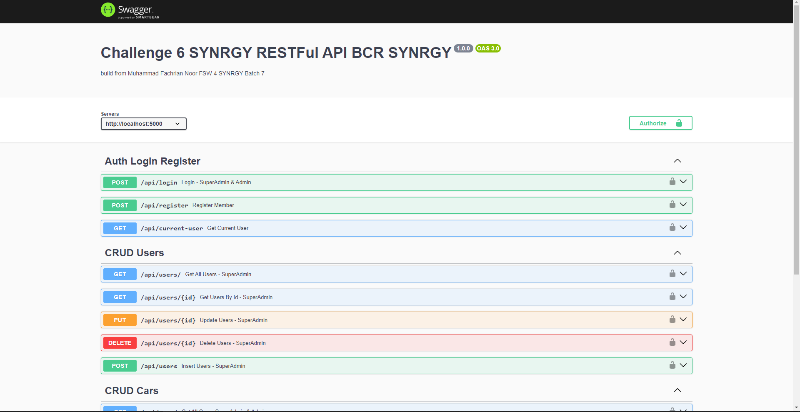
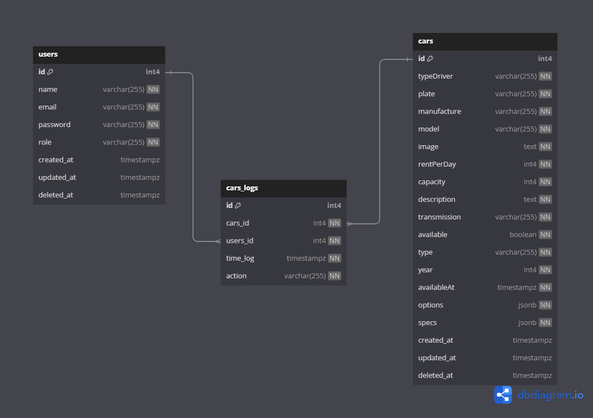

# SYNRGY 7 Challenge 6 RESTful API FSW 4
## Ansyarullah

### Cara pakai

1. Clone/Download ke lokal
2. Masuk ke direktori yang sudah di Clone/Download `cd nama-direktori-anda`
3. Selanjutnya menduplikasi file `.env.example` ke `.env` dan diisi dengan Database PostgreSQL milik Anda, akun Cloudinary dan JWT
4. Jalankan perintah `npm install` untuk menginstall library yang dibutuhkan
5. Jalankan perintah `npm run database:migrate` untuk membuat tabel melalui migration
6. Jalankan perintah `npm run database:seed` untuk mengisi data di tabel dengan data seeder
7. Jalankan perintah `npm run typeCompile` untuk mengcompile typescript menjadi javascript
8. Untuk langkah terakhir jalankan perintah `npm run start` untuk menjalankan program
9. (optional) jalankan perintah `npm run devType` untuk menjalankan program development

### Endpoint Dokumentasi API `/api/docs`

### Entity Relationship Diagram (ERD)

### Akun Super Admin
**Email:** `superadmin@mail.com` **Password:** `superadmin`
